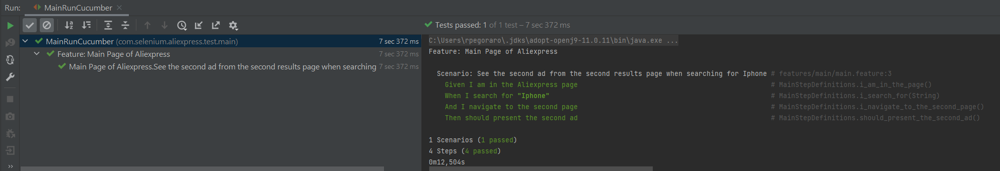

# AliExpress Automated Tests Project

### Instructions to run

* Is recommended use IntelliJ to run

1) Open the project in an IDE
2) Go to com.selenium.aliexpress.test.main
3) Find the class `MainRunCucumber` and click right button to run
4) After the execution, the results will be displayed in the JUnit report

### Configurations

Is possible change the browser to run, for that go to the `application.properties` file and change the configuration. Two options are allowed:
1) chrome
2) firefox

